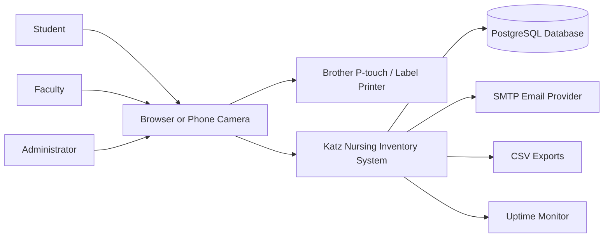
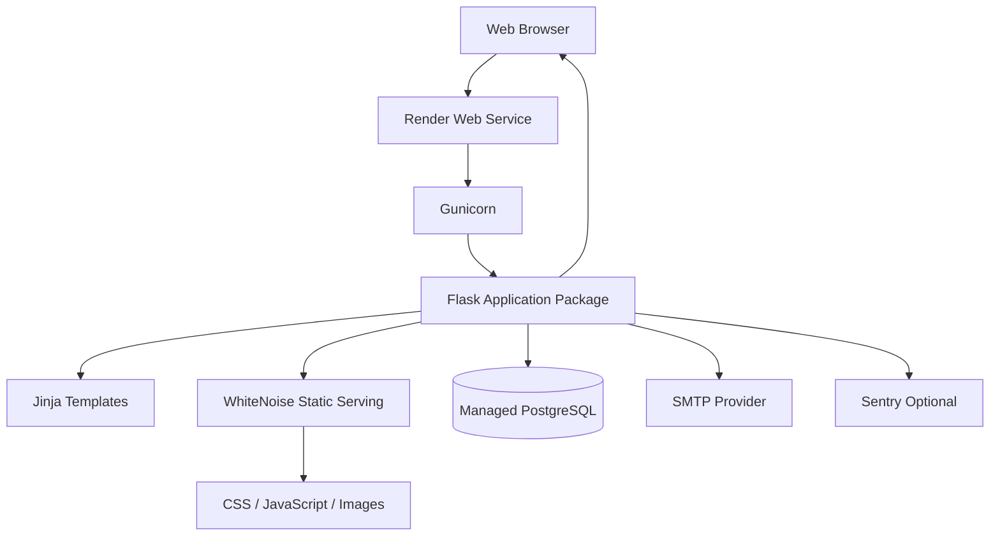
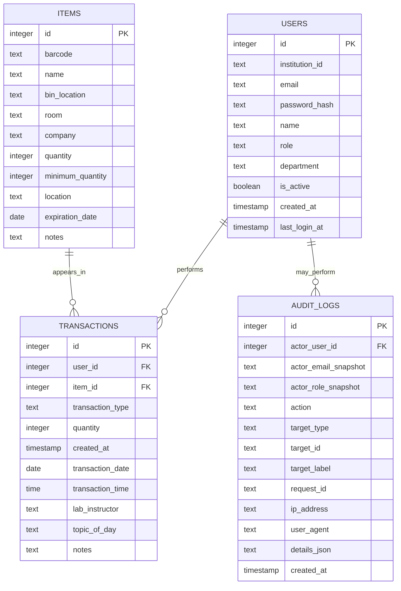
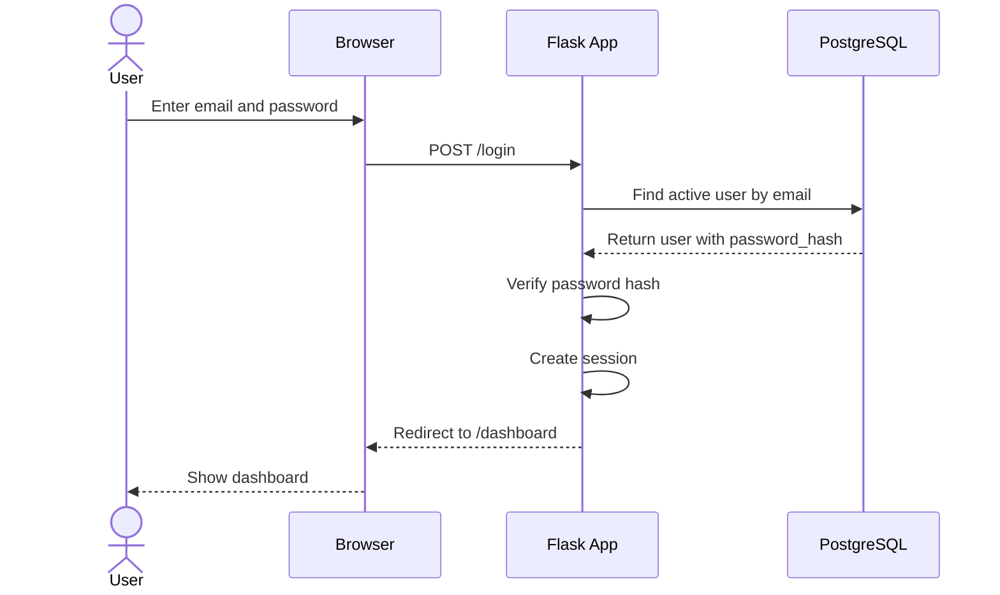
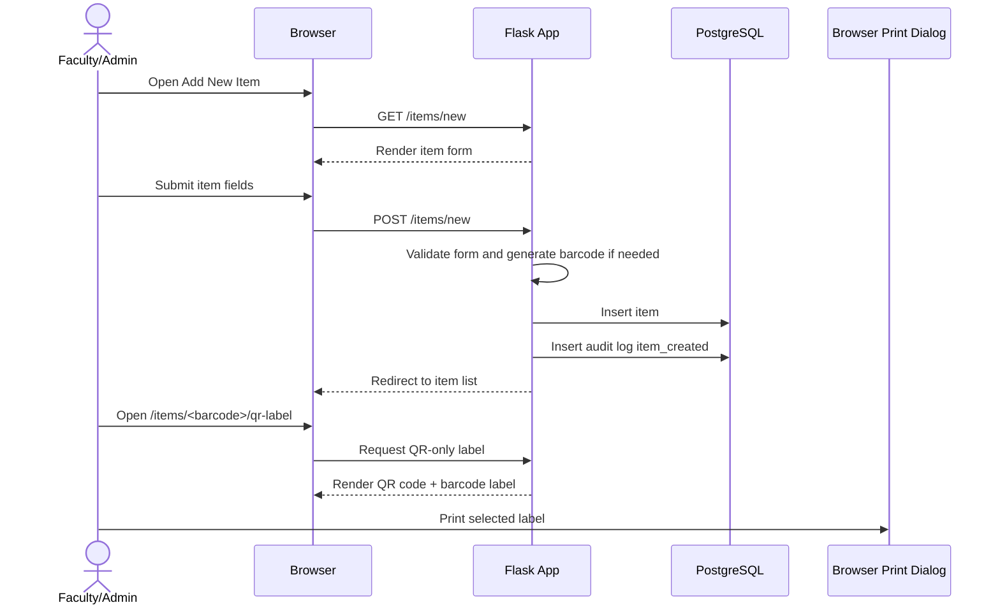
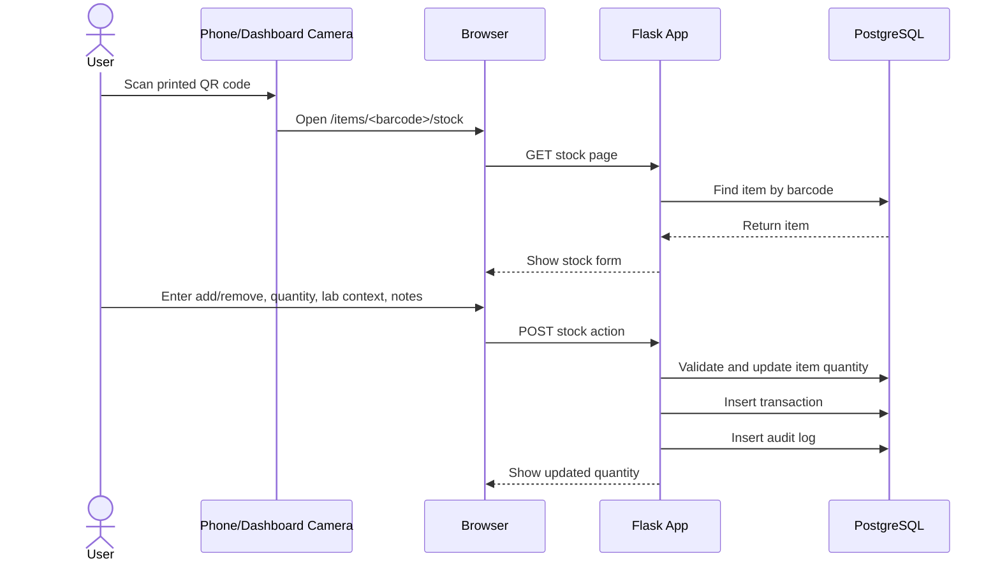
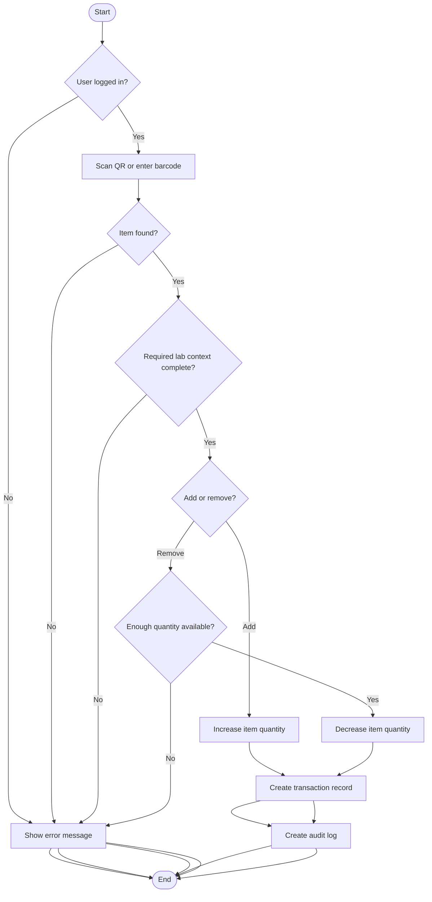
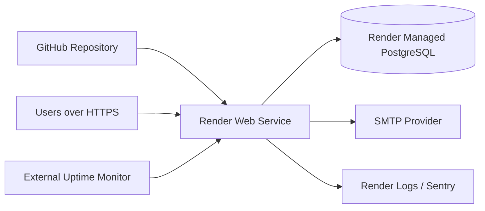

# Software Requirements Specification (SRS)

## Katz Nursing School Inventory Management System

Prepared: July 18, 2026

Project: Katz Nursing School Inventory Management System

## Content Page

1. [Document Control](#1-document-control)
2. [Purpose](#2-purpose)
3. [Project Background and Problem Statement](#3-project-background-and-problem-statement)
4. [Product Goal](#4-product-goal)
5. [Scope](#5-scope)
6. [Stakeholders and User Classes](#6-stakeholders-and-user-classes)
7. [User Roles and Permissions](#7-user-roles-and-permissions)
8. [Operating Environment](#8-operating-environment)
9. [System Overview](#9-system-overview)
10. [Functional Requirements](#10-functional-requirements)
11. [Data Requirements](#11-data-requirements)
12. [External Interface Requirements](#12-external-interface-requirements)
13. [Nonfunctional Requirements](#13-nonfunctional-requirements)
14. [Security, Privacy, and Compliance Requirements](#14-security-privacy-and-compliance-requirements)
15. [Architecture and Module Design](#15-architecture-and-module-design)
16. [Original Planning Timeline](#16-original-planning-timeline)
17. [System Workflows](#17-system-workflows)
18. [System Diagrams](#18-system-diagrams)
19. [Testing and Acceptance Criteria](#19-testing-and-acceptance-criteria)
20. [Deployment and Operations Requirements](#20-deployment-and-operations-requirements)
21. [Risks and Mitigations](#21-risks-and-mitigations)
22. [Current Status](#22-current-status)
23. [Future Enhancements](#23-future-enhancements)
24. [Appendix A: Preserved Source Headings](#24-appendix-a-preserved-source-headings)

---

## 1. Document Control

| Field | Value |
| --- | --- |
| Document type | Software Requirements Specification |
| Product | Katz Nursing School Inventory Management System |
| Prepared | July 18, 2026 |
| Primary audience | Project maintainer, university stakeholders, IT/security reviewers, deployment operators, future developers |
| Current implementation language | Python |
| Current web framework | Flask |
| Current database | PostgreSQL |
| Current deployment target | Render Web Service + Managed PostgreSQL |

This SRS reflects the project as it exists now, after the later implementation
work: Flask package refactor, PostgreSQL/Alembic migration support, QR labels,
QR-only labels, camera scanning, role separation, audit logs, export controls,
privacy/accessibility documentation, production configuration, and Render
deployment preparation.

Revision/source history:

| Date | Source/phase | Preserved purpose |
| --- | --- | --- |
| June 11 - June 16, 2026 | Original proposal phase | Requirements, workflow, item fields, roles, database assumptions |
| June 17 - June 23, 2026 | Prototype setup phase | Application setup, database, login, inventory table |
| June 24 - July 1, 2026 | QR/inventory workflow phase | QR route, item detail, printable labels, stock page |
| July 2 - July 8, 2026 | Reports/dashboard phase | Low stock, recent activity, exports |
---

## 2. Purpose

This document defines the requirements, current design, data model, workflows,
interfaces, security controls, deployment expectations, and acceptance criteria
for the Katz Nursing School Inventory Management System.

It consolidates the original planning/proposal document, high-level design,
architecture plan, and system diagrams into one SRS-style document.

The SRS is intended to help the project answer:

- what the product does,
- who uses it,
- what data it stores,
- what permissions exist,
- how QR-code inventory workflows work,
- what production/security controls are expected,
- what has already been implemented,
- what remains for future production readiness.

---

## 3. Project Background and Problem Statement

Manual inventory management is still common in nursing academic programs,
simulation labs, medication rooms, hospitals, and healthcare-related training
settings. Many teams rely on paper notes, handwritten sign-out sheets, or Excel
spreadsheets to track supplies.

Current inventory workflows often suffer from:

- manual entry of supply usage,
- delayed updates when items are added or removed,
- difficulty identifying who used specific items and when,
- counting errors,
- missing stock information,
- poor low-stock visibility,
- extra workload for faculty, staff, and lab coordinators,
- weak auditability for exports and user-management actions.

These issues can cause supply shortages, inaccurate records, wasted staff time,
and difficulty preparing for simulations, classes, clinical skills practice,
and medication-room activities.

---

## 4. Product Goal

The product goal is to replace manual spreadsheet-based tracking with a secure,
QR-code-based inventory management system for nursing education and healthcare
training environments.

The system should help staff answer:

- what items exist,
- where items are stored,
- how many are available,
- which items are low stock,
- who added or removed stock,
- when an action happened,
- what lab instructor/topic was associated with the action,
- who performed sensitive administrative, export, or system actions.

The system is designed as a hosted web application reachable over HTTPS, rather
than a tool tied only to one local computer.

---

## 5. Scope

### 5.1 In Scope

- Secure login using email and password.
- Student, faculty, and administrator roles.
- Invite-based user creation.
- Self-service password reset.
- Faculty/admin user management according to role rules.
- Inventory item creation and editing.
- Automatic internal barcode generation.
- QR-code generation for each item.
- Full label printing.
- QR-only compact label printing.
- Dashboard camera QR scan.
- Manual scan/stock workflow.
- Per-item QR stock workflow.
- Add/remove stock transactions.
- Required lab instructor, topic of day, and notes on stock transactions.
- Low-stock item list.
- Transaction history with filters and pagination.
- Transaction CSV export for faculty/admin.
- Inventory CSV export for faculty/admin.
- Audit logs for sensitive actions.
- Administrator database-status page.
- Administrator audit-log viewer.
- Health endpoint for monitoring.
- PostgreSQL database with Alembic migrations.
- Production configuration through environment variables.
- Gunicorn/WhiteNoise deployment readiness.
- Render hosting preparation.

### 5.2 Out of Scope for Current Version

- Direct Bluetooth printer control from Flask.
- Native mobile application.
- Enterprise SSO/SAML/OIDC.
- Multi-tenant customer isolation.
- Purchase-order integrations.
- Automated retention purge/archive jobs.
- Automated reorder suggestions.
- Real-time push notifications.
- Patient, diagnosis, grade, or clinical-record management.

---

## 6. Stakeholders and User Classes

| User class | Description | Primary needs |
| --- | --- | --- |
| Student | Uses supplies during lab/simulation activities | Find items, scan QR codes, add/remove stock, view inventory context |
| Faculty | Supervises labs and manages student access | Student workflows plus item management, label printing, student account management, reporting |
| Administrator | Operates and configures the system | Faculty workflows plus faculty management, database status, audit-log review |
| Simulation lab staff | Helps maintain supplies and equipment | Item lookup, stock updates, low-stock awareness, reports |
| University IT/security reviewer | Reviews production readiness | Security, privacy, auditability, deployment, logs, backups |
| Deployment operator | Hosts and maintains the app | Environment variables, migrations, health checks, logs, backup/restore |

---

## 7. User Roles and Permissions

| Role | Main purpose | Key permissions |
| --- | --- | --- |
| Student | Use inventory during labs and simulations | View items, view transaction history, scan/use stock workflows |
| Faculty | Manage lab inventory and students | Student permissions plus add/edit items, print labels, manage student accounts, export CSV files |
| Administrator | Operate the system | Faculty permissions plus manage faculty/student accounts, view database status, view audit logs |

Important permission rules:

- Students cannot add or edit items.
- Students cannot manage users.
- Students cannot access database status.
- Students cannot view audit logs.
- Students cannot export CSV files.
- Faculty can manage students.
- Faculty cannot manage faculty or administrator users.
- Faculty cannot access database status.
- Faculty cannot view audit logs.
- Administrators can manage faculty and student users.
- Administrator accounts are protected from deactivation/deletion.
- Database status is administrator-only.
- Audit logs are administrator-only.

---

## 8. Operating Environment

### 8.1 Local Development

The app runs locally using:

```text
Python
Flask
PostgreSQL
Jinja2 templates
HTML/CSS/JavaScript
```

Typical local commands:

```bash
flask --app app run --debug
alembic upgrade head
pytest -q
```

### 8.2 Production

Target production environment:

```text
Render Web Service
Render Managed PostgreSQL
Gunicorn
WhiteNoise
HTTPS/TLS
SMTP provider
Optional Sentry
External uptime monitor
```

The production app reads configuration from environment variables. Secrets must
not be committed to Git.

---

## 9. System Overview

The system is a server-rendered Flask web application backed by PostgreSQL.

High-level flow:

```text
User browser
    -> HTTPS
    -> Render/cloud web service
    -> Gunicorn
    -> Flask application
    -> psycopg2
    -> Managed PostgreSQL
```

Supporting services:

```text
GitHub             -> source control and CI/CD
Alembic            -> database migrations
WhiteNoise         -> static asset serving
SMTP provider      -> invite/reset email delivery
Sentry optional    -> error monitoring
Uptime monitor     -> /health checks
Managed Postgres   -> backups and point-in-time recovery
```

---

## 10. Functional Requirements

### 10.1 Authentication and Sessions

The system shall:

- allow users to log in using email and password,
- hash passwords before storing them,
- reject inactive users,
- support invite-based password setup,
- support password reset through signed time-limited links,
- use sessions for authenticated access,
- expire idle sessions after a configurable period,
- use CSRF protection on state-changing forms,
- rate-limit login and sensitive auth actions,
- require recent reauthentication before destructive admin actions.

### 10.2 User Management

The system shall:

- allow administrators to create faculty and student users,
- allow faculty to create student users,
- send invite links through SMTP when configured,
- optionally show invite/reset links only when explicitly enabled for testing,
- allow invite resend for users with pending passwords,
- allow allowed users to be activated/deactivated,
- block ordinary deletion when accountability records require preservation,
- protect administrator accounts from deactivation/deletion,
- audit user-management actions.

### 10.3 Item Management

The system shall:

- allow faculty/admin to create items,
- allow faculty/admin to edit items,
- auto-generate internal barcodes when omitted,
- prevent duplicate barcodes,
- store vendor in the database column `company` while showing Vendor in the UI,
- store optional expiration dates as `DATE` or `NULL`,
- show all items in an inventory list,
- show per-item detail pages,
- show low-stock items where quantity is less than or equal to minimum quantity,
- audit item create/update actions.

### 10.4 QR Codes and Labels

The system shall:

- generate a QR PNG for each known item,
- encode the item's stock page URL in the QR code,
- provide a full printable label,
- provide a QR-only compact printable label,
- allow faculty/admin to print labels,
- audit QR label views.

The QR-only compact label shall contain only:

```text
QR code
barcode/internal code below it
```

The full label shall contain:

```text
item name
barcode/internal code
QR code
room
bin
vendor if present
expiration date if present
```

### 10.5 Stock Transactions

The system shall:

- allow logged-in users to add or remove stock,
- support manual scan entry through `/scan`,
- support QR-driven stock entry through `/items/<barcode>/stock`,
- require transaction type,
- require positive quantity,
- require lab instructor,
- require topic of day,
- require notes,
- block removal when requested quantity exceeds available quantity,
- update item quantity immediately,
- create a transaction record,
- create audit context for stock_added or stock_removed.

### 10.6 Dashboard and Camera Scan

The system shall:

- show dashboard counts,
- show total item count,
- show low-stock count,
- show recent transactions,
- provide a camera scan panel,
- allow QR scanning from the dashboard,
- stop the camera after a successful scan.

### 10.7 Transaction History

The system shall:

- show transaction history to logged-in users under current policy,
- paginate transaction history,
- filter by date range,
- filter by item,
- filter by user,
- filter by lab instructor,
- filter by topic of day,
- filter by action type,
- export full filtered transaction CSV to faculty/admin only,
- audit transaction CSV exports.

### 10.8 Reports and Exports

The system shall:

- export current inventory CSV to faculty/admin,
- export transaction CSV to faculty/admin,
- redirect unauthenticated users to login,
- redirect students away from export endpoints,
- audit export actions,
- avoid storing exported CSV contents in audit logs.

### 10.9 Audit Logs

The system shall:

- store append-only audit rows for sensitive actions,
- snapshot actor email and role at the time of action,
- include request ID, IP address, and user agent when available,
- avoid logging passwords, tokens, CSRF values, SMTP secrets, database URLs, full
  request bodies, or CSV contents,
- provide administrator-only audit-log viewing.

Audited actions include:

```text
user_created
invite_resent
user_deactivated
user_activated
user_deleted
password_set_by_cli
item_created
item_updated
qr_label_viewed
stock_added
stock_removed
transactions_csv_exported
inventory_csv_exported
db_status_viewed
```

### 10.10 Health and Operations

The system shall:

- provide `/health` without authentication,
- return JSON status,
- check database connectivity using a lightweight query,
- avoid exposing secrets or user data through health checks,
- provide administrator-only `/db-status`,
- support structured request logging,
- support optional Sentry error monitoring.

---

## 11. Data Requirements

### 11.1 Users

The system shall store:

- id,
- institution_id,
- email,
- password_hash,
- name,
- role,
- department,
- is_active,
- created_at,
- last_login_at.

Rules:

- Email is unique and used for login.
- Institution ID is optional and unique when provided.
- Password hash may be null for invited users.
- Passwords are never stored in plaintext.

### 11.2 Items

The system shall store:

- id,
- barcode,
- name,
- bin_location,
- room,
- company/vendor,
- quantity,
- minimum_quantity,
- location,
- expiration_date,
- notes.

Rules:

- Barcode is unique.
- Quantity and minimum quantity must not be negative.
- Expiration date is optional.
- Notes must not contain patient names, diagnoses, grades, or unnecessary
  sensitive student information.

### 11.3 Transactions

The system shall store:

- id,
- user_id,
- item_id,
- transaction_type,
- quantity,
- created_at,
- transaction_date,
- transaction_time,
- lab_instructor,
- topic_of_day,
- notes.

Rules:

- Transactions reference users and items.
- Transaction type is add or remove.
- Transaction history must remain available for accountability according to the
  university retention policy.

### 11.4 Audit Logs

The system shall store:

- id,
- actor_user_id,
- actor_email_snapshot,
- actor_role_snapshot,
- action,
- target_type,
- target_id,
- target_label,
- request_id,
- ip_address,
- user_agent,
- details_json,
- created_at.

Rules:

- Audit logs are append-only from the UI.
- Audit logs preserve actor details even if the user later changes.
- Audit logs do not store passwords, tokens, secrets, full request bodies, or CSV
  contents.

---

## 12. External Interface Requirements

### 12.1 Web User Interface

The application shall provide browser pages for:

- login,
- forgot password,
- set/reset password,
- dashboard,
- all items,
- low-stock items,
- item detail,
- add/edit item,
- full label,
- QR-only label,
- scan item,
- per-item stock action,
- transaction history,
- manage users,
- database status,
- audit logs.

### 12.2 QR Camera Interface

The dashboard scan feature shall use the browser camera permission flow. The app
does not require a dedicated USB barcode scanner.

### 12.3 Printer Interface

Printing is performed through the browser and operating-system print dialog.
Flask does not directly control Bluetooth label printers.

For the Brother P-touch D610BT workflow:

```text
Flask label page -> browser print dialog -> macOS printer queue -> printer
```

### 12.4 Email Interface

The system shall send invite/reset emails through SMTP when configured.

Temporary hosted testing may use:

```text
ALLOW_LOCAL_AUTH_LINKS=true
```

This must be disabled before real production use.

### 12.5 Database Interface

The application connects to PostgreSQL using `DATABASE_URL`.

Alembic uses the same `DATABASE_URL` for migrations.

---

## 13. Nonfunctional Requirements

### 13.1 Security

The system shall:

- require login for application workflows,
- use password hashing,
- use CSRF protection,
- use secure cookie settings in production,
- require strong `SECRET_KEY` in production,
- prevent use of the development secret in production,
- use HTTPS in production,
- support HSTS after HTTPS is verified,
- avoid committing secrets,
- rate-limit login and sensitive actions.

### 13.2 Privacy

The system shall:

- minimize stored personal data,
- avoid patient/clinical/grade data,
- control exports,
- audit sensitive actions,
- document data handling and retention expectations.

### 13.3 Reliability

The system shall:

- use PostgreSQL as the source of truth,
- manage schema changes with Alembic,
- run migrations once per deploy,
- provide database health checks,
- support managed backups/PITR in production.

### 13.4 Performance

The system shall:

- paginate transaction history,
- index transaction filters and ordering,
- index audit-log queries,
- avoid loading all history records on normal pages,
- use controlled CSV export paths.

### 13.5 Maintainability

The system shall:

- use a package structure instead of one large `app.py`,
- separate routes by area,
- keep stock transaction logic shared,
- keep environment configuration centralized,
- maintain automated tests.

### 13.6 Accessibility

The system targets WCAG 2.2 AA where practical.

The system includes:

- semantic page structure,
- visible focus states,
- explicit form labels,
- accessible password show/hide controls,
- alert/status roles for key messages,
- camera scanner status announcements.

Manual accessibility testing is still required before full university-wide
production launch.

---

## 14. Security, Privacy, and Compliance Requirements

The system is FERPA-aware because user activity and transaction data may be tied
to students in a university setting.

Sensitive categories include:

- account data,
- transaction data,
- notes,
- CSV exports,
- audit logs,
- operational logs.

Policy requirements:

- Do not enter patient names, diagnoses, grades, Social Security numbers, or
  unnecessary sensitive student information in Notes.
- CSV exports must be role-controlled.
- CSV exports must be audit logged.
- Retention periods must be confirmed by university stakeholders.
- Deactivation is preferred over deletion when accountability history exists.

Related policy documents:

- `PRIVACY_AND_DATA_HANDLING.md`
- `DATA_RETENTION_POLICY.md`
- `CSV_EXPORT_POLICY.md`
- `ADMIN_NOTES_TRAINING.md`
- `ACCESSIBILITY_STATEMENT.md`

---

## 15. Architecture and Module Design

### 15.1 Original Source Heading and Date

Original source:

```text
Legacy source: ARCHITECTURE.md
Heading: Architecture Plan
Date: July 10, 2026
```

### 15.2 Current Package Structure

```text
app.py
    Thin compatibility entrypoint for Flask/Gunicorn.

inventory/
    __init__.py
        create_app() entrypoint.

    core.py
        Application assembly, shared route helpers, security hooks,
        audit helper, and compatibility exports.

    config.py
        Environment-backed configuration and production guards.

    db.py
        PostgreSQL connection helpers.

    cli.py
        Flask CLI commands: init-db, db-upgrade, db-downgrade,
        set-password, check-config.

    observability.py
        Sentry initialization and structured request logging.

    auth/
        Login, logout, reauth, forgot/reset password, set-password,
        password hashing, and signed token helpers.

    dashboard/
        Home, dashboard, and /health routes.

    items/
        Item list, low stock list, item detail, add/edit item forms,
        barcode generation, QR image route, full label, and QR-only label.

    stock/
        Manual scan route, per-item stock route, and shared stock service.

    transactions/
        Transaction history, filters, pagination, export, and query helpers.

    reports/
        Inventory CSV export.

    admin/
        User management, database status, and audit-log viewer.

    services/
        Email integration helpers.
```

### 15.3 Compatibility Entrypoints

Current supported commands:

```bash
flask --app app run --debug
gunicorn app:app -c gunicorn.conf.py
```

Long-term package entrypoint:

```bash
gunicorn "inventory:create_app()" -c gunicorn.conf.py
```

### 15.4 Ownership Boundaries

| Module area | Responsibility |
| --- | --- |
| `config.py` | Environment variables, constants, production guards |
| `db.py` | PostgreSQL connection wrapper and teardown |
| `auth/` | Identity, login, tokens, password flows |
| `items/` | Item CRUD, QR images, label pages |
| `stock/` | Shared stock add/remove behavior |
| `transactions/` | History, filters, pagination, CSV export |
| `reports/` | Inventory export |
| `admin/` | User management, database status, audit log viewer |
| `services/` | Integrations such as email |

---

## 16. Original Planning Timeline

Original source:

```text
Legacy source: design_docx/planning_and_proposal.md
Heading: Proposal: QR-Code-Based Inventory Management System for Nursing
Education and Healthcare Settings
Document date: not explicitly stated
Deadline: July 20, 2026
```

Original schedule:

| Phase | Dates | Deliverables |
| --- | --- | --- |
| Phase 1: Requirements and Design | June 11 - June 16 | Finalize item fields, user roles, workflow, database schema, and hosting assumptions |
| Phase 2: Prototype Setup | June 17 - June 23 | Application structure, database, login screen, and basic inventory table |
| Phase 3: QR and Inventory Workflow | June 24 - July 1 | Item detail page, QR image route, printable label page, QR-driven stock page, and shared transaction logging |
| Phase 4: Reports and Dashboard | July 2 - July 8 | Low-stock view, recent activity, inventory reports, and CSV/Excel export |
| Phase 5: Security Hardening | July 9 - July 15 | Real authentication, invites, password reset, CSRF, session timeout, admin re-auth, lockout, and automated tests |
| Phase 6: Final Proposal and Demo Preparation | July 16 - July 20 | Prepare demo, documentation, final proposal, and presentation-ready summary |

Updated status as of July 18, 2026:

- Core workflow is implemented.
- PostgreSQL/Alembic migration layer is implemented.
- QR labels and QR-only labels are implemented.
- Camera scan workflow is implemented.
- Audit logs are implemented.
- Export controls are implemented.
- Production configuration is implemented.
- Render deployment testing has started.
- SMTP production email configuration is still pending.

---

## 17. System Workflows

### 17.1 Login

```text
User opens /login
User enters email/password
Application validates email, password hash, role, and active status
Application creates session
User is redirected to /dashboard
```

### 17.2 Invite and Set Password

```text
Faculty/admin creates allowed user
Application stores user with NULL password_hash
Application generates signed invite token
SMTP sends invite email, or testing fallback shows link when explicitly enabled
User opens /set-password/<token>
User sets password
User can log in
```

### 17.3 Create Item and Print Labels

```text
Faculty/admin opens Add New Item
User enters item details
Application generates barcode if omitted
Application stores item
Application audits item_created
User opens full label or QR-only label
Browser print dialog prints selected label format
```

### 17.4 Scan QR and Update Stock

```text
User scans QR code using phone camera or dashboard camera
QR opens /items/<barcode>/stock
User selects add/remove
User enters quantity, lab instructor, topic, and notes
Application validates request
Application updates item quantity
Application creates transaction row
Application creates audit log row
```

### 17.5 Transaction Export

```text
Faculty/admin opens Transaction History
User applies optional filters
User clicks Export Transactions CSV
Application exports full filtered set
Application audits transactions_csv_exported
```

Students are blocked from CSV export.

---

## 18. System Diagrams

Original source:

```text
Legacy source: design_docx/SYSTEM_DIAGRAMS.md
Heading: System Diagrams: Nursing Inventory Management System
Document date: not explicitly stated
```

The diagrams below are updated to reflect the current system.

### 18.1 System Context Diagram



### 18.2 High-Level Architecture Diagram



### 18.3 Entity Relationship Diagram



### 18.4 Login Sequence Diagram



### 18.5 Add Item and Print QR-Only Label



### 18.6 Stock Action Sequence Diagram



### 18.7 Activity Diagram: Inventory Action



### 18.8 Deployment Diagram



---

## 19. Testing and Acceptance Criteria

### 19.1 Automated Testing

The test suite uses real PostgreSQL test databases.

Coverage includes:

- authentication,
- invite/reset flows,
- role permissions,
- item forms,
- QR labels,
- QR-only labels,
- stock add/remove,
- transaction filtering and pagination,
- CSV exports,
- export access control,
- migrations,
- health endpoint,
- audit logs.

Current test command:

```bash
pytest -q
```

Recent expected result:

```text
91 passed
```

### 19.2 Acceptance Criteria

The system is acceptable for demo/pilot when:

- an administrator can log in securely,
- faculty can create student accounts,
- users can set passwords through invite links,
- a faculty/admin user can create an item,
- the system can auto-generate a barcode,
- full labels and QR-only labels can be printed,
- a phone/dashboard camera can scan a QR code,
- scanning opens the correct stock page,
- add/remove stock updates quantity,
- transaction rows capture user, item, quantity, date, time, lab instructor,
  topic, and notes,
- low-stock items are visible,
- transaction history can be filtered and paginated,
- students cannot export CSV files,
- faculty/admin exports are audit logged,
- admin can view audit logs,
- `/health` returns OK when the app/database are healthy,
- deployment uses HTTPS and production secrets.

---

## 20. Deployment and Operations Requirements

### 20.1 Production Configuration

Required environment variables:

- APP_ENV,
- SECRET_KEY,
- DATABASE_URL,
- APP_BASE_URL.

Production email variables:

- EMAIL_PROVIDER,
- EMAIL_FROM,
- SMTP_HOST,
- SMTP_PORT,
- SMTP_USERNAME,
- SMTP_PASSWORD,
- SMTP_USE_TLS,
- SMTP_USE_SSL.

Useful optional variables:

- BARCODE_PREFIX,
- SESSION_IDLE_MINUTES,
- TRANSACTIONS_PAGE_SIZE,
- SENTRY_DSN,
- RATELIMIT_STORAGE_URI,
- ALLOW_LOCAL_AUTH_LINKS for temporary hosted testing only.

### 20.2 Database Operations

Rules:

- Production databases use Alembic migrations.
- Run `alembic upgrade head` before traffic reaches a new app version.
- Do not use `flask init-db` on production databases.
- Use managed PostgreSQL backups and point-in-time recovery.

### 20.3 First Admin Bootstrap

First production admin setup requires:

1. Insert administrator row into the production database.
2. Run `flask --app app set-password <email> <password>` against production
   database connection.
3. Log in through the hosted web app.
4. Confirm admin access to dashboard, user management, database status, and
   audit logs.

### 20.4 Monitoring

The system shall support:

- `/health` uptime checks,
- request logs,
- Sentry events when configured,
- audit logs for sensitive actions,
- database backup/restore drill after hosting is finalized.

---

## 21. Risks and Mitigations

| Risk | Mitigation |
| --- | --- |
| Users forget to scan items | Keep QR labels visible and make scan-to-stock workflow simple |
| QR labels become damaged | Reprint labels from full or QR-only label pages |
| Inventory count drifts from reality | Use periodic physical count/reconciliation workflow |
| Users enter sensitive data in Notes | Provide admin/user training and notes policy |
| CSV exports expose sensitive data | Restrict exports to faculty/admin and audit exports |
| Public app receives attacks | Use HTTPS, CSRF, password hashing, lockout, rate limiting, secure cookies |
| Database grows over time | Use indexes, pagination, retention policy, and future archive jobs |
| Email is not configured | Use SMTP for production; use explicit testing fallback only temporarily |
| Printer does not appear in app | Add printer to operating system; browser print dialog controls printer selection |
| Scope grows too large | Keep MVP focused on QR inventory workflow and defer enterprise features |

---

## 22. Current Status

Implemented:

- email/password login,
- role-based access,
- invite/reset password flows,
- explicit hosted testing fallback for auth links,
- PostgreSQL data layer,
- Alembic migrations,
- item create/edit/list/detail,
- automatic barcode generation,
- QR image route,
- full label page,
- QR-only label page,
- dashboard camera scan,
- per-item QR stock page,
- manual scan page,
- transaction history,
- transaction filters,
- transaction pagination,
- low-stock page,
- inventory CSV export,
- transaction CSV export for faculty/admin,
- audit logs,
- admin audit viewer,
- database status page,
- `/health` endpoint,
- production config guards,
- Gunicorn config,
- WhiteNoise,
- Sentry support,
- structured logging,
- CI test workflow,
- Render deployment preparation.

Still pending or requiring stakeholder confirmation:

- real production SMTP provider,
- custom domain,
- final Render/AWS hosting decision after pilot needs are clear,
- managed database backup/PITR verification,
- production smoke test on live domain,
- formal accessibility audit,
- final retention periods,
- whether students should continue seeing transaction history,
- whether faculty exports remain approved or become admin-only,
- enterprise SSO decision.

---

## 23. Future Enhancements

Possible future work:

- expiration-date alerts,
- reorder suggestions,
- supplier management,
- purchase-order generation,
- advanced analytics dashboard,
- multi-room or multi-campus support,
- multi-tenant customer isolation,
- enterprise SSO/SAML/OIDC,
- audit-log filters,
- audit-log retention cleanup,
- archive tables for old transactions,
- optional export size/date limits,
- mobile app if web camera scanning is not enough.

---

## 24. Appendix A: Preserved Source Headings

### 24.1 Original Proposal Heading

```text
Proposal: QR-Code-Based Inventory Management System for Nursing Education and
Healthcare Settings
```

Original date:

```text
No explicit document date in source file.
Original timeline dates are preserved in Section 16.
```

### 24.2 Original High-Level Design Heading

```text
High-Level Design: Katz Nursing School Inventory Management System
Date: July 15, 2026
```

### 24.3 Original Architecture Heading

```text
Architecture Plan
Date: July 10, 2026
```

### 24.4 Original System Diagrams Heading

```text
System Diagrams: Nursing Inventory Management System
```

Original date:

```text
No explicit document date in source file.
```

---

## Conclusion

The Katz Nursing School Inventory Management System is now a production-oriented
Flask/PostgreSQL inventory application for nursing education and simulation-lab
settings. It supports secure role-based access, QR-code stock workflows,
transaction history, low-stock visibility, CSV exports, audit logs, production
configuration, and deployment readiness.

This SRS consolidates the original proposal, high-level design, architecture
plan, and diagrams into one updated reference document for future development,
university review, deployment, and product planning.
