# System Diagrams: Nursing Inventory Management System

## Purpose of This File

This file contains visual diagrams for the inventory management system.

The goal is to understand the system from different design angles:

- What parts the system has.
- How the parts communicate.
- What data the system stores.
- What objects or classes may exist in code.
- How users move through important workflows.

The diagrams are written using Mermaid syntax. Mermaid lets us create diagrams inside Markdown files.

## 1. System Context Diagram

This diagram shows the system from the outside.

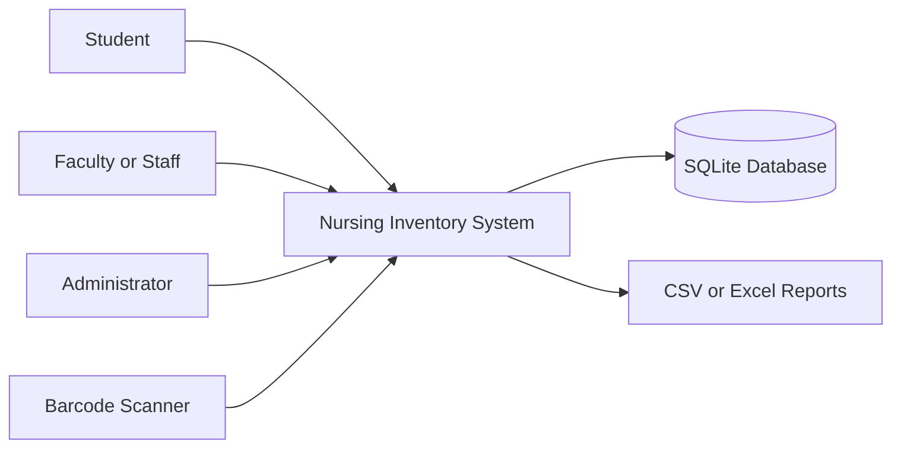

Why this diagram matters:

It shows who or what interacts with the system. The main outside actors are users and the barcode scanner. The system stores data in SQLite and later produces reports.

## 2. High-Level Architecture Diagram

This diagram shows the main technical layers.

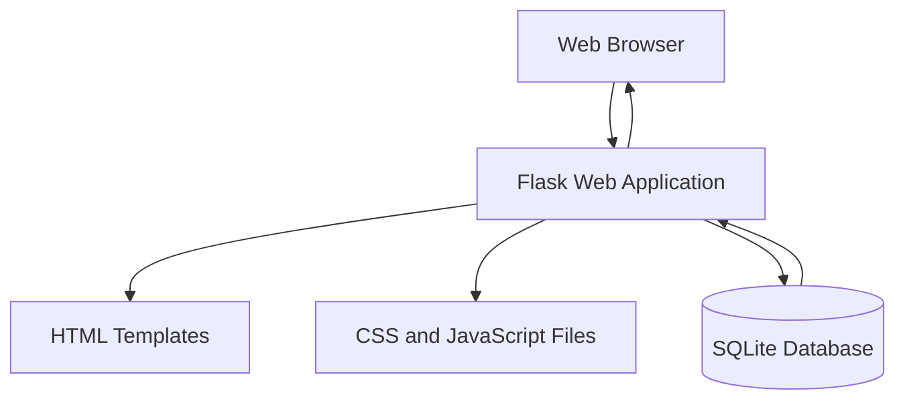

Why this diagram matters:

It shows how the browser, Flask app, HTML templates, static files, and database work together.

## 3. Entity Relationship Diagram

This diagram shows the database relationships.

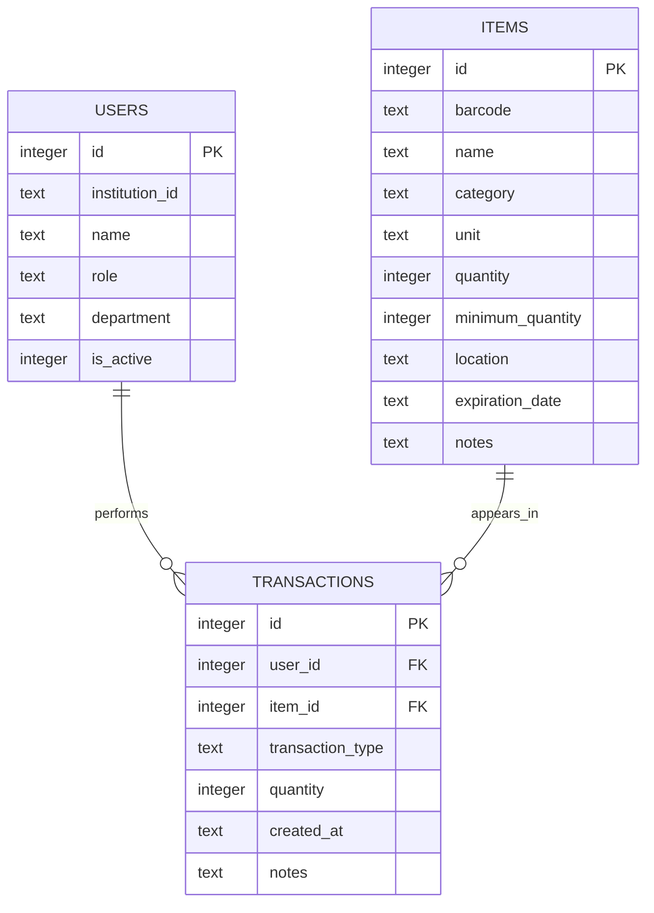

Why this diagram matters:

It shows that one user can perform many transactions, and one item can appear in many transactions.

The `items` table stores the current inventory count. The `transactions` table stores the history of inventory changes.

## 4. Class Diagram

This diagram shows possible backend classes or concepts we may use as the code grows.

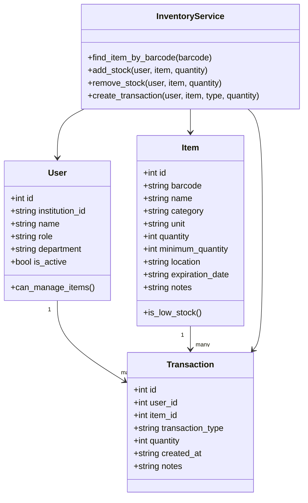

Why this diagram matters:

Even though the first Flask version may start with simple functions, this diagram helps us understand the main code responsibilities.

The `InventoryService` is a possible future layer that keeps inventory rules in one place.

## 5. Login Sequence Diagram

This diagram shows what happens when a user logs in.

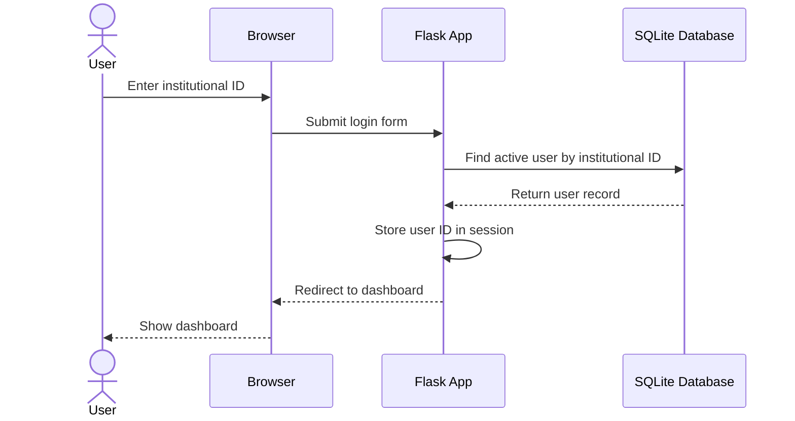

Why this diagram matters:

It shows that login is not only a page. It is a flow involving the browser, Flask app, database, and session.

## 6. Add New Item Sequence Diagram

This diagram shows how an item is added to the system.

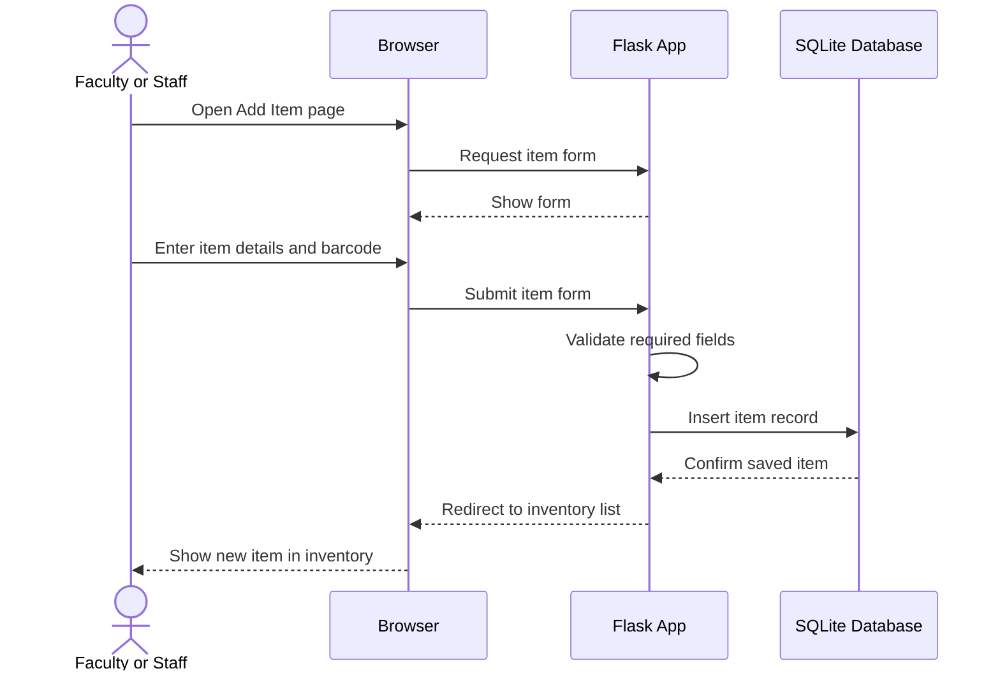

Why this diagram matters:

It shows that an item must be saved in the database before barcode scanning can find it later.

## 7. Remove Stock Sequence Diagram

This diagram shows the main barcode usage flow for removing inventory.

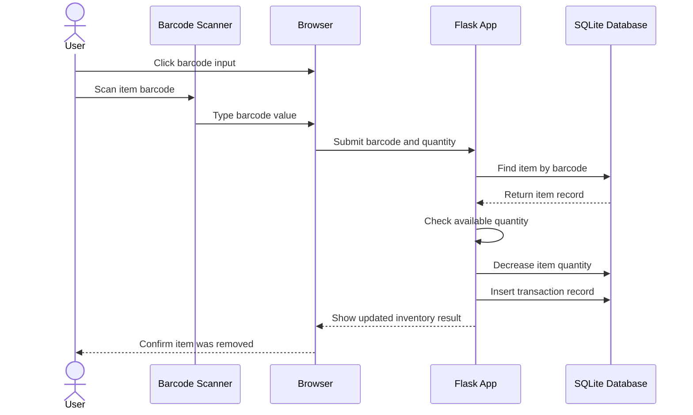

Why this diagram matters:

This is one of the most important system flows. It shows how scanning an item leads to an automatic database update and transaction record.

## 8. Add Stock Sequence Diagram

This diagram shows how restocking works.

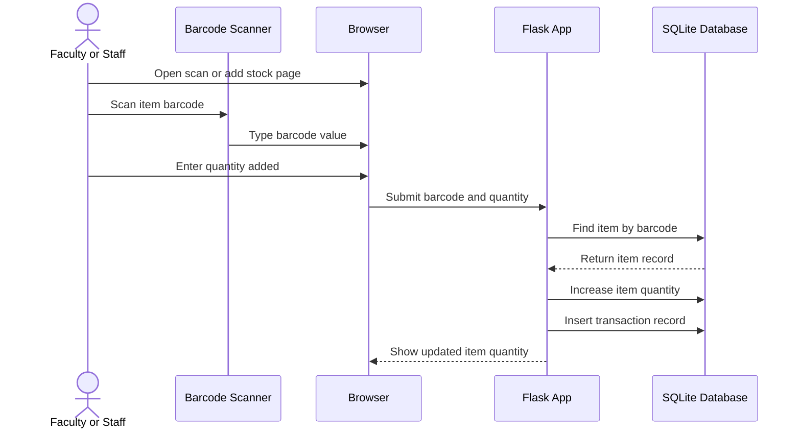

Why this diagram matters:

It shows that adding stock and removing stock are similar flows. The main difference is whether quantity increases or decreases.

## 9. Activity Diagram: Inventory Action

This diagram shows the decision path for adding or removing inventory.

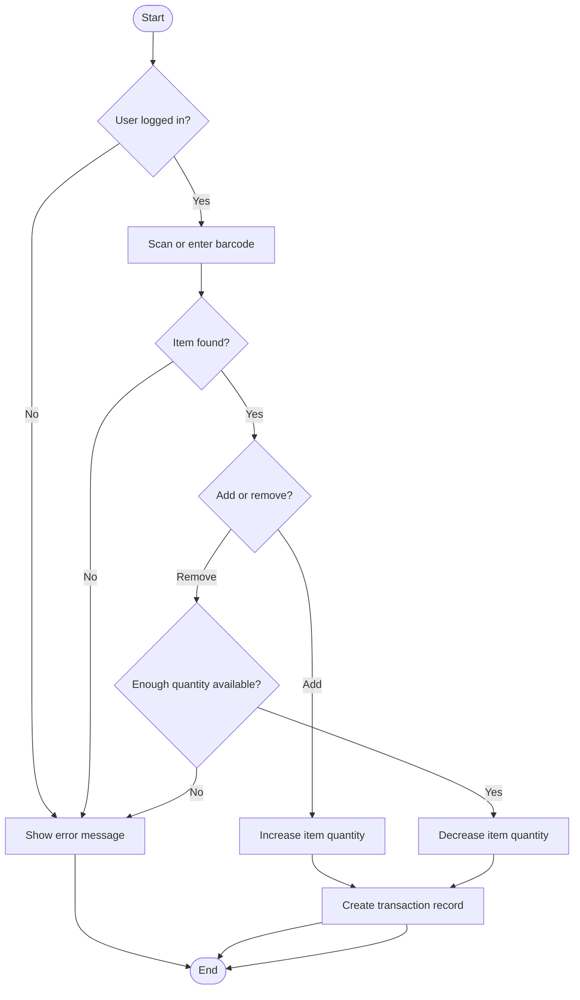

Why this diagram matters:

It shows important decision points, such as whether a user is logged in, whether the barcode exists, and whether enough quantity is available before removing stock.

## 10. Deployment Diagram for MVP

This diagram shows the first low-cost deployment idea.

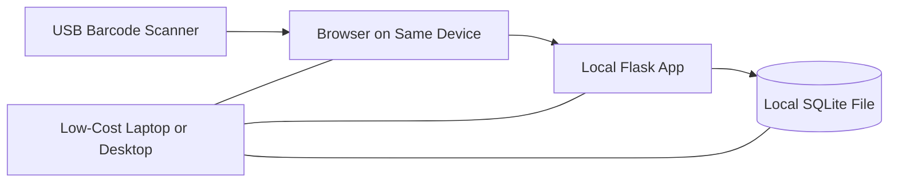

Why this diagram matters:

The MVP can run on one local machine. This keeps cost and setup complexity low.

## 11. Future Deployment Diagram

This diagram shows a possible future version if the system grows.

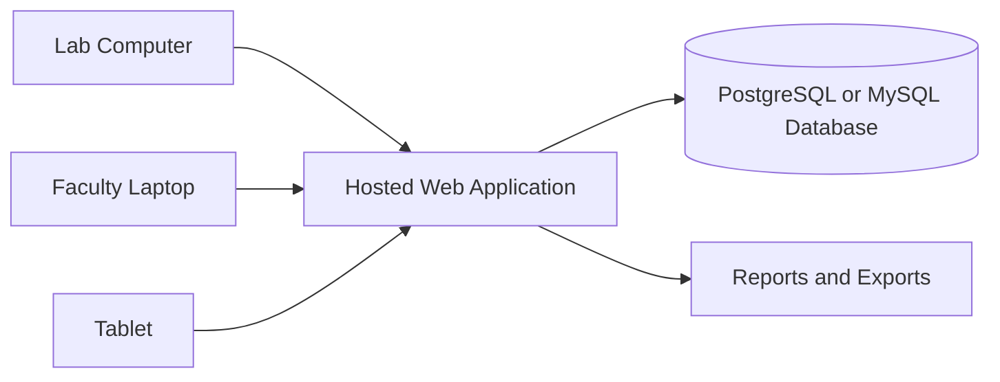

Why this diagram matters:

This shows how the system could later support multiple devices, a hosted application, and a stronger database.

## Summary

These diagrams help us understand the system before adding more code.

The most important diagrams for the first build are:

- Entity relationship diagram.
- Login sequence diagram.
- Add item sequence diagram.
- Add stock sequence diagram.
- Remove stock sequence diagram.

These directly match the first database tables and the core MVP workflows.
